# How To Build a Robot
This tutorial will give a simple overview of how to connect the different elements of the physical robots. We will assume that you already have a robot morphology and all the physical components ready.

## Materials
Gather the following materials:

- Fixed blocks
- Head block
- Servo connector elements (each servo needs two elements)
- Servo joints
- Screws
- Screwdriver

## General Design Principle
The robots in Revolve consist of only 3 elements: A single head block, a joint block, and a regular block. Thus, the assembly process is not very complex, since it mainly consists of connecting the same joints and blocks over and over again. Hence, this tutorial will walk you through the process of connecting two blocks with a joint in between.

## Step 1: Check Your Materials
Here is a short overview of the materials we will be working with. Note that the 3D printed elements come in various colours, but this is only of an aesthetic property; all the elements are the same.

### Screws
You will need to use several screws. They should be included with the servo joint packaging.

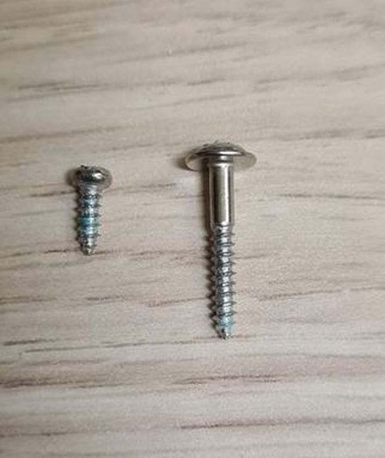

### Fixed Blocks
This is the fixed block element. The connector elements can slide into each face of the block.

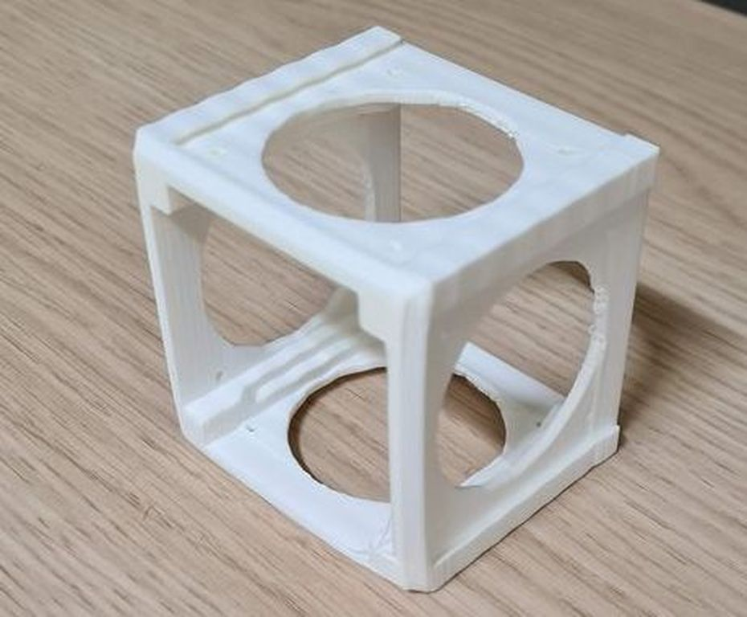
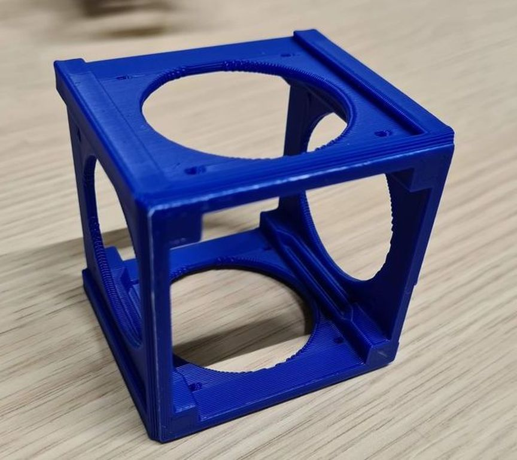

### Servo Joint
We will use these servomotors to act as joints, together with their connection elements (see below). This servomotor is already unpacked.

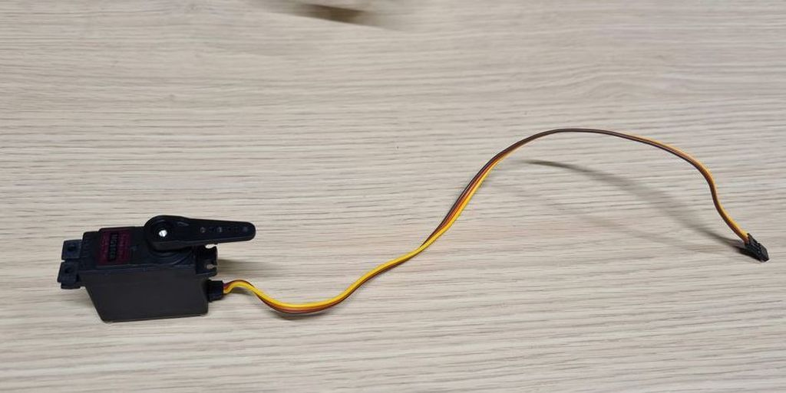

### Servo Joint Connector Elements
The servo motor will fit into these elements: A female element, with a hole for a hinge, and a male element, with a stump acting as a hinge.

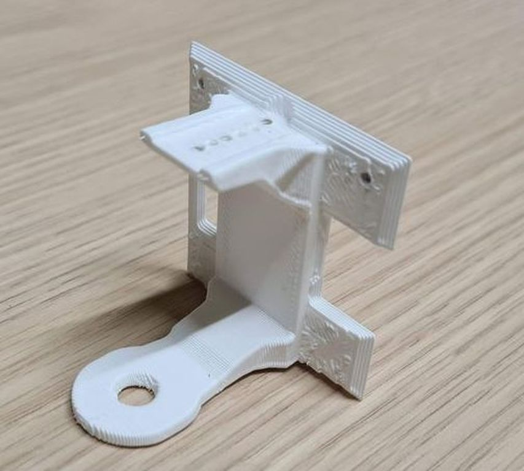
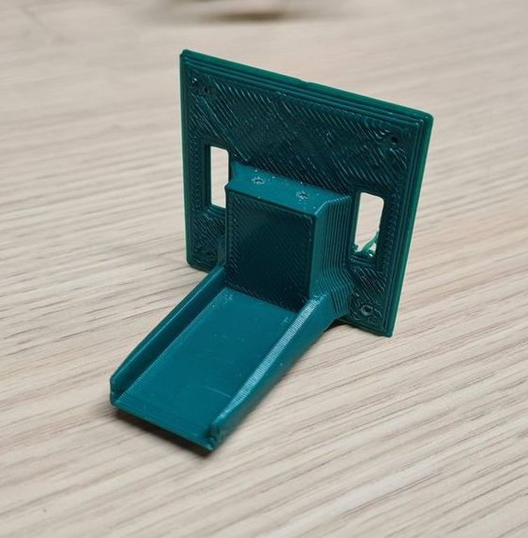

Note that the positions where the screws will go into might still be solid. This is fine, with some force you can turn the screw through the material.

## Step 2: Connecting One End of the Joint to the Block
Let's begin by connecting the servo motor to the first block. Slide one of the servo connector elements into the fixed block. It does not matter what end you start with, in this example we use the male element which can be identified by the stump under the carriage.

1. Make sure that the connector element is in the right orientation.
    

    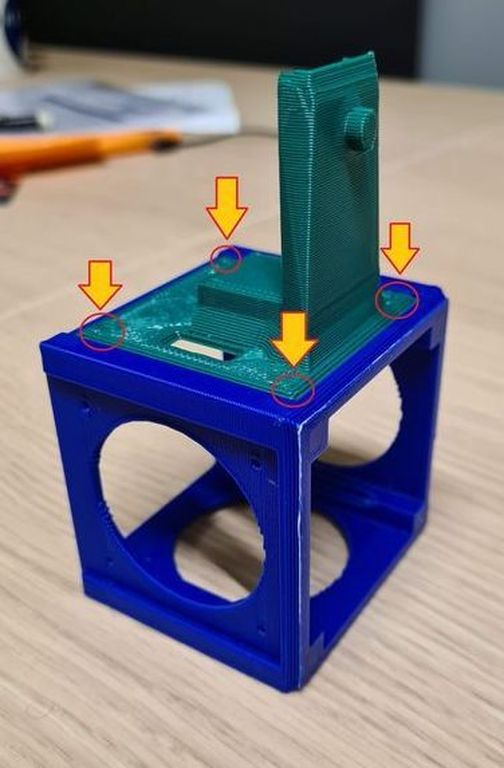
    

2. Firmly attach the connection element onto the fixed brick using the short screws by using the small guiding holes
 at each corner. You may have to screw through the material if the block is new, this is fine.
3. Next, put the servo onto the carriage of the male connection element. Use the rubber bits and long screws that come with the servo packaging to firmly secure the servo to the connection element.

    

    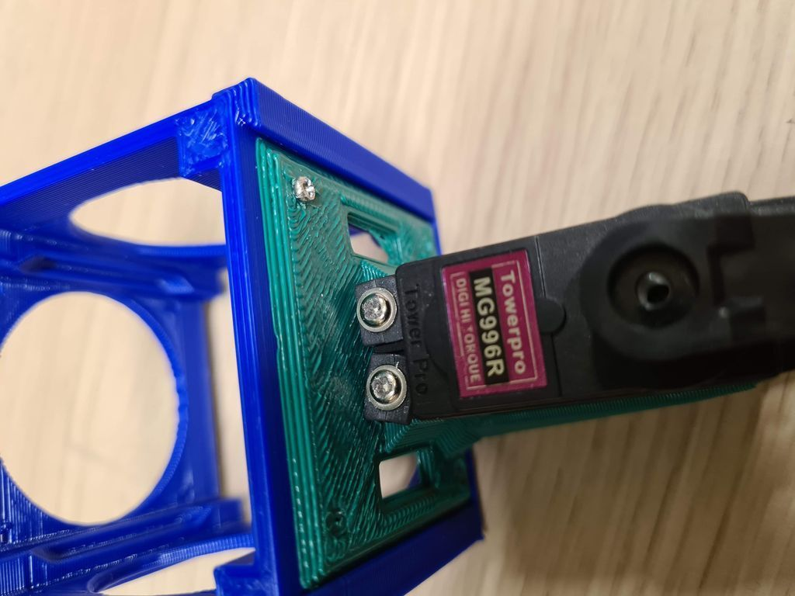
    

That's it! one end of the servo is now attached.

## Step 3: Connecting the Other End
1. Put the other connection element onto the servo. In this example, we now use the female element which can be identified by the extension with a small hole. Put the female element in place by fitting the   male stump into the hole, as pictured.

    

    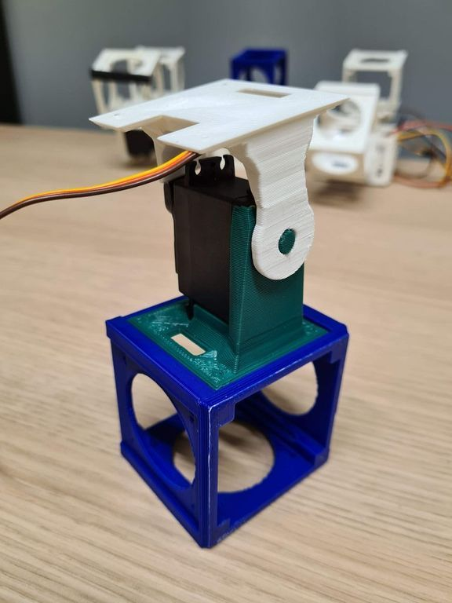
    

2. Now secure the female element to the servo by using at least 3 small screws on the other side, as pictured.

    

    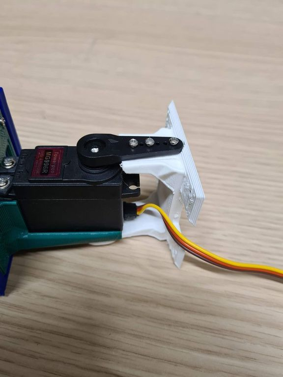
    

3. Now slide the female element onto a neighbouring block, and secure it in place by screwing in the corners using the small screws, just like we did with the first block and the male element.

    

    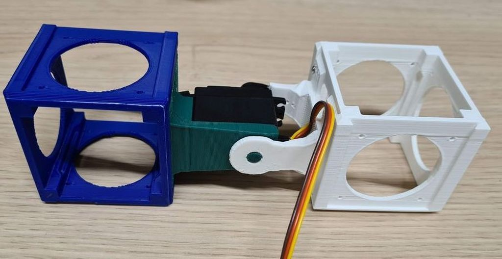
    

And there we go! We have just connected to blocks with a joint in between! You can repeat the same steps as often as is necessary