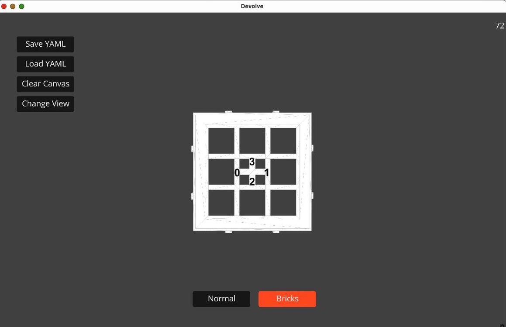

# Installing Devolve

---
<!--
Ursina is a super simple and elegant game engine;
thus giving us great visualization capabilities,
without the upfront costs normally associated with game development. -->

## GitHub Repo

First things first we to get the code, we can find this on the same GitHub repository that is hosting this documentation: [Jacopo-DM/EC-Devolve](https://github.com/Jacopo-DM/EC-Devolve)

We pull the repo with:
```bash
git clone git@github.com:Jacopo-DM/EC-Devolve.git
```

or by downloading it using the "Download" button.


---

## Setting Up A Conda Environment

A conda environment with python `3.8` will be needed, this can be created with:
```bash
conda create --name ec-dev python=3.8
```

or, if you want to copy my exact environment, I provided an `environment.yaml` file.

You can install this environment by running (when in the home directory):
```bash
conda env create -f environment.yml
```

and is activated with:
```bash
conda activate ec-dev
```

---

## Installing Pip Packages

Once our environment is created, we need to install some `pip` packages.

This project makes use of two external packages, which can be installed with:
```bash
pip install ursina pyyaml
```

Alternatively, if you want an exact copy of my pip installs, I provided a `requirements.txt`.

You can install all the required packages by running (when in the home directory):
```bash
pip install -r requirements.txt
```

---

## Downloading Assets

The final step is downloading the ["Assets" zip file](../files/assets.zip) and the ["Phenotype" zip file](../files/phenotypes.zip). <br>
These should be unzipped in the home directory, such that your directory looks as follows:

```bash
./
├── Devolve.py
├── README.md
├── assets
├── documentation
├── environment.yml
├── legacy
├── phenotypes
└── requirements.txt
```

---

## Running Devolve

You can check that the installation was successful by running:
```bash
python Devolve.py
```

This should open up a window looking as follows:
<center>
    
</center>

This means the installation was successful

---

<center>
    Installing Devolve is **done**
</center>