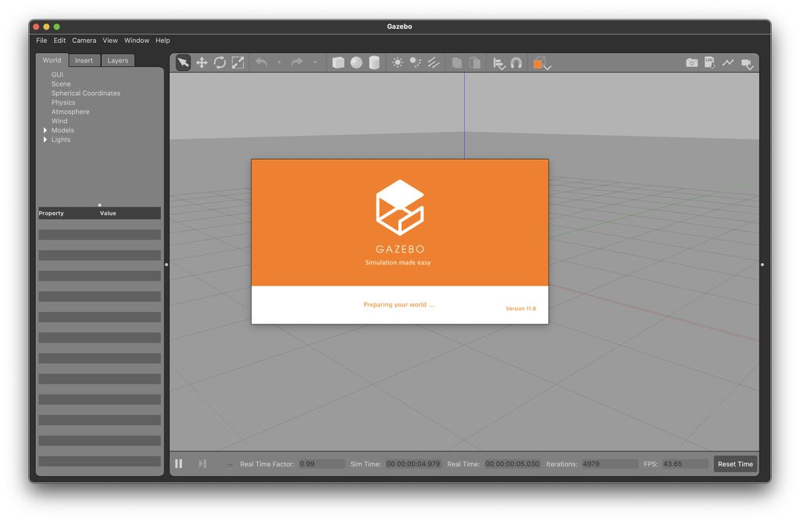
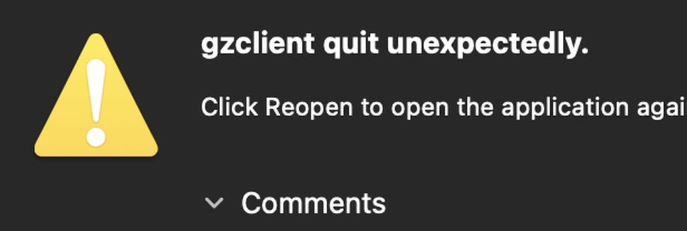

# Install Gazebo on Mac OS X

Following the [Install Gazebo on Mac OS X](https://github.com/ci-group/revolve/wiki/Installation-Instructions-for-Gazebo#install-gazebo-on-mac-os-x)
from the [Revolve Wiki](https://github.com/ci-group/revolve/wiki#tutorials) is a ***TRAP***, it won't work and it's too hard.
<center>
    Forget `#!bash brew`, it won't work.
</center>

---

## Prerequisites

Before we can install Gazebo, we must install some requirements through conda.

!!! warning "Order Matters"
    The order in which these conda installs happen matters, going out of order may break your install.

First, we make sure the environment we created in the previous step is active:
```bash
conda activate ex-64
```

Then we proceed with installing `boost` and `opencv`
```bash
conda install boost -y
conda install opencv -y
```

---

## Gazebo

After installing the prerequisites, we install Gazebo in the new conda env:

```bash
conda install gazebo -y
```

Once we run that in our terminal, we can test our installation in the normal way (as explained on the Revolve Wiki).

First, we check which version of gazebo we installed, running:
```bash
gazebo --version
```
```bash
# Expected output:
    Gazebo multi-robot simulator, version 11.10.1
    Copyright (C) 2012 Open Source Robotics Foundation.
    Released under the Apache 2 License.
    http://gazebosim.org
```

!!! note "Gazebo Version"
    I am using, and will be using `Gazebo version 11.10.1`,
    can't promise anything for other versions :)

!!! note "Prompts"
    Both `gzserver --verbose` and `gazebo` should raise a prompt to ask for access to the ports ("network connection"), which you must "allow".

If that worked, the next test is `gzserver`, we run:

```bash
gzserver --verbose
```
```bash
# Expected output:
    Gazebo multi-robot simulator, version 11.10.1
    Copyright (C) 2012 Open Source Robotics Foundation.
    Released under the Apache 2 License.
    http://gazebosim.org

    [Msg] Waiting for master.
    [Msg] Connected to gazebo master @ http://127.0.0.1:11345
    [Msg] Publicized address: 192.168.178.61
    [Msg] Loading world file [/opt/homebrew/Caskroom/miniforge/base/envs/ec-64/share/gazebo-11/worlds/empty.world]
```


Finally, we can test the GUI interface by running:
```bash
gazebo
```

This should return a running instance, like so:



!!! note
    When you close the app you may get:
    <center>
        
    </center>
    This is *normal*, ignore it, it's part of life.


---

<center>
    Gazebo installation is **done**
</center>