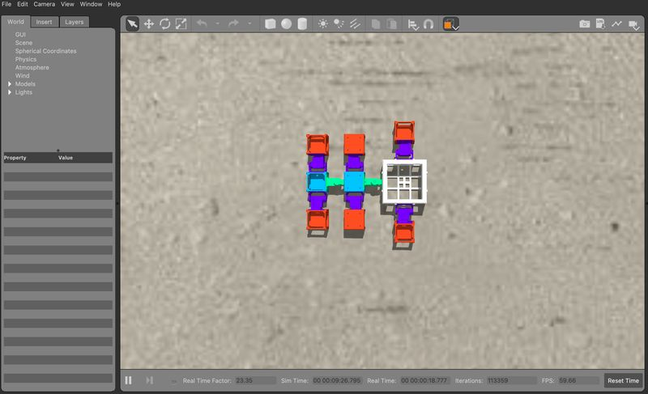

# Running Revolve

Now that we installed revolve, we need to try running it

---

## Watch Robot

The wiki suggests running the command:
```bash
./revolve.py --simulator-cmd=gazebo --manager watch_robot.py
```

this should run Gazebo, but it will ultimately crash, as the robot it tries to load is incompatible.
Therefore we need a robot YAML file that does not break our simulation, this can be done in several ways.

---

## Getting Morphologies

Either generating new morphologies by running a command like:
```bash
./revolve.py --simulator-cmd=gazebo --manager=experiments/EC_students/manager_population_cppn.py
```

Which is an example code from the `ec_research_2021` branch, once complete this will have generated many working morphologies in the `Revolve-EC/experiments/EC_students/data/default_experiment/1/data_fullevolution/phenotypes` directory.

!!! note
    Successfully running the above command is already a sign of a functional installation

### Download Morphology
Alternatively, you can download a working morphology that I used by [clicking here](../files/phenotypes.zip).
This will download a zip file, unzip to find a folder containing a working morphology `tardigrade.yaml`

---

## Watch Robot (Attempt 2)
The working morphology should be added to the `Revolve-EC` main directory.

We then open up the `watch_robot.py` file:
```bash
code watch_robot.py
```

We need to change the line `path = "phenotype_2870.yaml"` to `path = "tardigrade.yaml"` (line 54) in the case you downloaded my file, otherwise use the right name for your robot.

Running:
```bash
./revolve.py --simulator-cmd=gazebo --manager watch_robot.py
```

should now yield something that looks like:


This signals a successful installation.

---

<center>
    Installing Revolve & this tutorial is **done**
</center>